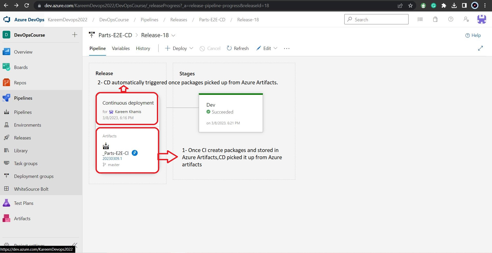

* [Project Name](#project-name) 
* [Project Description](#project-description) 
* [Services used in the project](#services-used-in-the-project) 
* [Walk through Continuous Integration (CI) steps](#walk-through-continuous-integration-ci-steps) 
* [Walk through Continuous Integration (CI) steps](#walk-through-continuous-integration-ci-steps) 
#  Project Name: 
Parts-Unlimited .Net WebApp E2E

#  Project Description:

Parts-Unlimited .Net WebApp E2EThe project is an e-commerce website for online shopping for automotive parts and accessories. It was built, tested, delivered, and deployed using DevOps automated CI/CD life cycle.

 # Services used in the project:

 - Git
 - Azure Repos 
 - Azure Pipeline 
 - Azure Artifacts
 - Azure Web Apps
 - Azure SQL Database
 - Terraform 

#  Walk through Continuous Integration (CI) steps

1. The application source code and infrastructure code are pushed to Azure Repo via Git.
2. The Continuous Integration (CI) pipeline configured to be triggered automatically once any commit occurred 
3. The Continuous Integration (CI) pipeline has built/tested the application and infrastructure as code.
4. The Continuous Integration (CI) pipeline created the application package, which contains all of the app code such as CSS, HTML, java scripts, and so on, as well as the infrastructure package, which contains all of the terraform code for the Azure environment.
5. The Continuous Integration (CI) pipeline pushed and stored the two packages to Azure artifacts.

The following image shows up the used sequence on the CI Pipeline build agent sequence and the CI Pipeline
CI Pipeline build agent sequence:

* CI Pipeline: (You can check it through this link) https://dev.azure.com/KareemDevops2022/DevOpsCourse/_build/results?buildId=132&view=logs&j=275f1d19-1bd8-5591-b06b-07d489ea915a

#  Walk through Continuous Deployment (CD) steps:

 1. The Continuous Integration (CD) pipeline is configured to be triggered automatically whenever a package is discovered in Azure artifacts.
 
 
 
 2. The Continuous Deployment (CD) pipeline picked the the application package and the infrastructure package from Azure Artifacts.

 
 
 3. The Continuous Deployment (CD) pipeline using Terraform file (Infrastructure as code) to provision App service on Azure, Azure SQL Server and Database.
 
 4. The terraform file will configure the resource groups, SQL DB, maintain the connection string and configure the firewall rules, Here is the link for Terraform file (https://github.com/KareemKhamis/Parts-Unlimted-.Net-WebApp-E2E/blob/main/infra/websql.tf)
 5. The Continuous Deployment (CD) pipeline suceefully deployed the app package to the provisioned environment.As shown below:
 
 
 
* CD Pipeline: (You can check it through this link) https://dev.azure.com/KareemDevops2022/DevOpsCourse/_releaseProgress?_a=release-environment-logs&releaseId=18&environmentId=18
